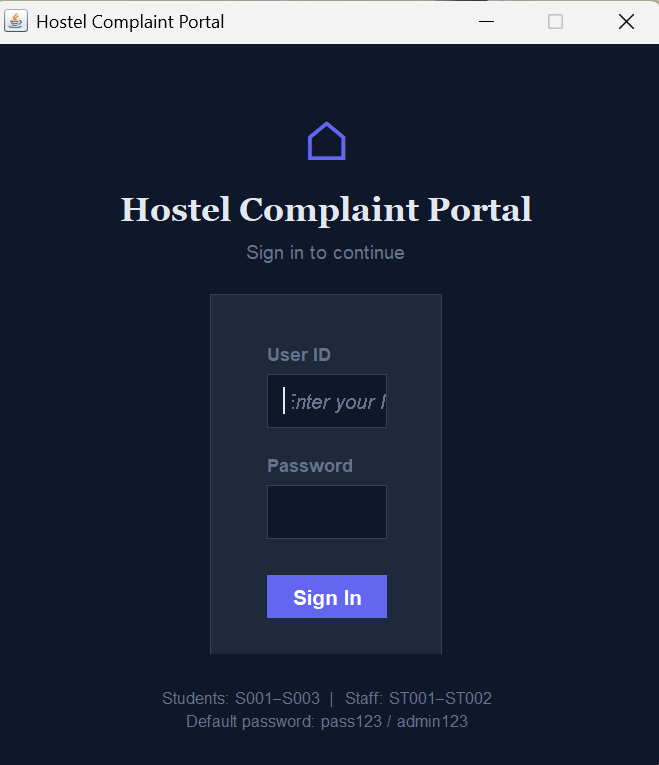
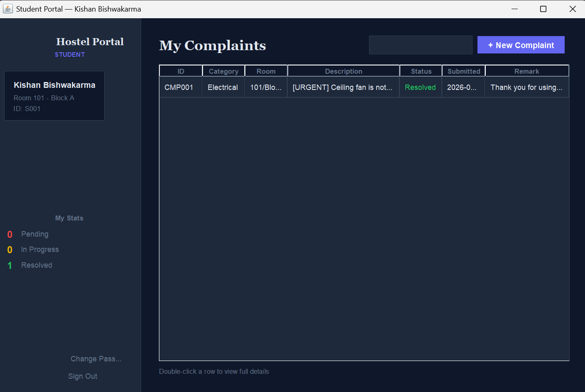
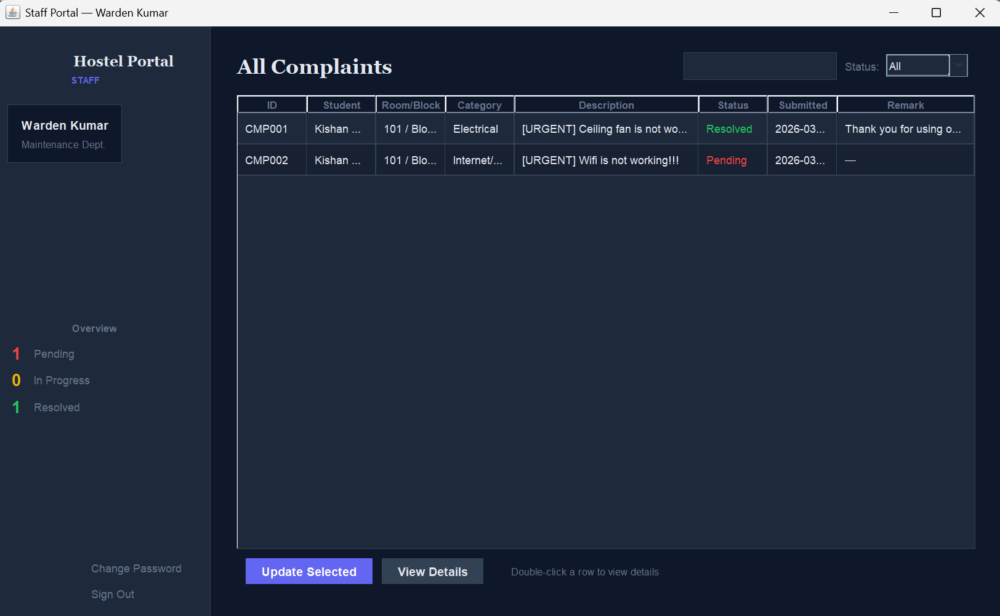

# Hostel Room Complaint Portal

The Java Swing application for hostel management digitizes the complaint system. While staying in the rooms, students can file complaints. The hostel management handles these complaints based on their needs.

---

## Screenshots

### Login


### Student Dashboard


### Submit Complaint


### Complaint History


### Staff Dashboard


### Update Complaint Status


### Complaint Details


---

## Features

### Student Side
1. You can submit your complaints along with category, description, and priority (Normal/Urgent).
2. Live stats in sidebar: Pending, In Progress, Resolved counts.
3. Search complaints by keyword, instant filtering as you type.
4. Double-click any row to view your full complaint details.
5. Change password securely from within the app.

### Staff side
1. View all the complaints for all the students.
2. View the complaints based on their status like pending, in progress, resolved, and live search.
3. Update the status of the complaints with an optional remark.
4. Double click or click 'View Details' to view the complaints in detail.
5. The overview in the sidebar auto refreshes every time the page is updated.
6. Change password

### General
1. Role-based login, so students see a completely different screen than staff members
2. All data is persisted across sessions in plain text files in the directory `data/`
3. Auto-seeding of default user accounts on first run, no setup necessary
4. No external libraries, pure Java SE and Swing

---

## Java Concepts Demonstrated

| Concept | Where Applied |
|---|---|
| Abstract class | `User` — base class for `Student` and `Staff` |
| Inheritance | `Student extends User`, `Staff extends User` |
| Polymorphism | `getDashboardTitle()` and `toString()` overridden in both subclasses |
| Enum | `ComplaintStatus` (PENDING, IN_PROGRESS, RESOLVED) |
| Collections | `List<Complaint>`, `List<User>`, `Map<ComplaintStatus, Long>` |
| Streams and lambdas | Filtering, searching, and counting complaints |
| File I/O | `BufferedReader` and `PrintWriter` for persistent text file storage |
| Serializable | `User` and `Complaint` implement `Serializable` |
| GUI (Swing) | Login screen, dual dashboards, dialogs, tables, custom renderers |
| Event handling | `ActionListener`, `DocumentListener`, `MouseAdapter` |

---
## How to Run

### Requirements
- Java JDK 11 or higher

### Linux / Mac
```bash
chmod +x run.sh
./run.sh
```

### Windows
```cmd
mkdir out
mkdir data
javac -d out -sourcepath src src\Main.java src\model\*.java src\manager\*.java src\ui\*.java
cd out
java Main
```

### IDE (IntelliJ / Eclipse / VS Code)
1. Open the `HostelComplaintPortal/` folder as a project
2. Mark `src/` as the Sources Root
3. Run `Main.java`

---

## Default Login Credentials

| Role | User ID | Password | Details |
|---|---|---|---|
| Student | S001 | pass123 | Kishan Bishwakarma, Room 101, Block A |
| Student | S002 | pass123 | Priya Sharma, Room 204, Block B |
| Student | S003 | pass123 | Rahul Verma, Room 312, Block C |
| Staff | ST001 | admin123 | Warden Kumar, Maintenance |
| Staff | ST002 | admin123 | Ms. Patel, Electrical |

---

## Data Storage Format

### data/users.txt
```
STUDENT:S001:Kishan Bishwakarma:pass123:101:Block A
STAFF:ST001:Warden Kumar:admin123:Maintenance
```

### data/complaints.txt
```
CMP001|S001|Kishan Bishwakarma|101|Block A|Plumbing|Tap is leaking|PENDING|2025-03-25 10:30|2025-03-25 10:30|
```

Both files are plain text. Delete them to reset all data — defaults are re-created on next run.

---

## Author

Built by **Kishan Bishwakarma** as the BYOP capstone for the *Programming in Java* course.
